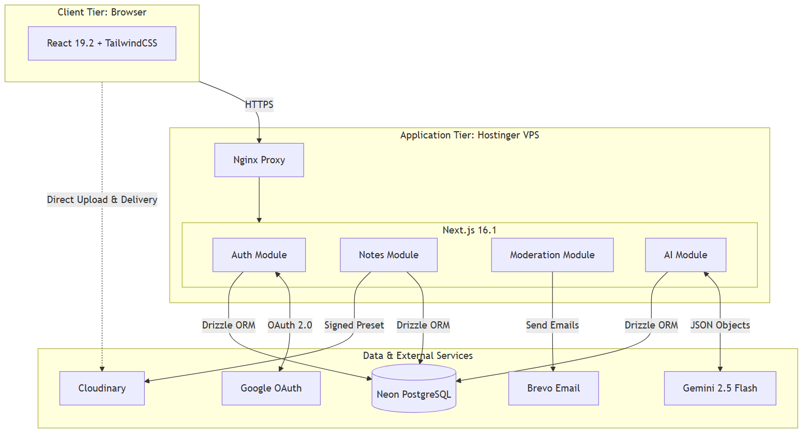
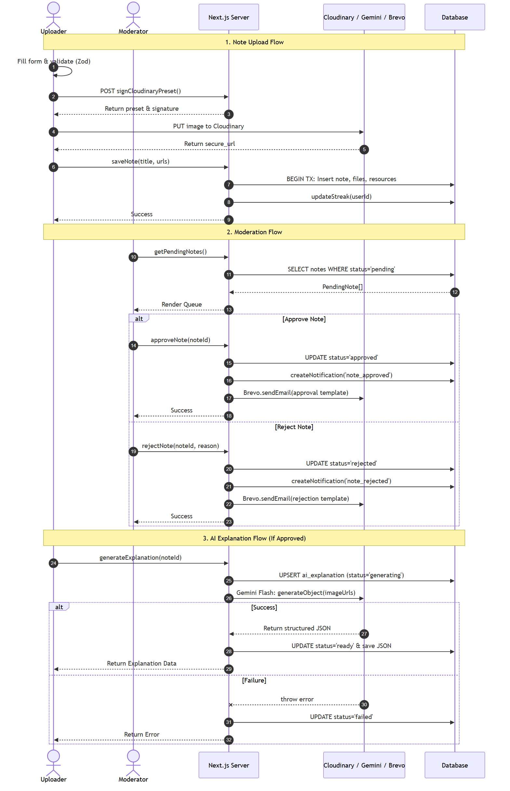
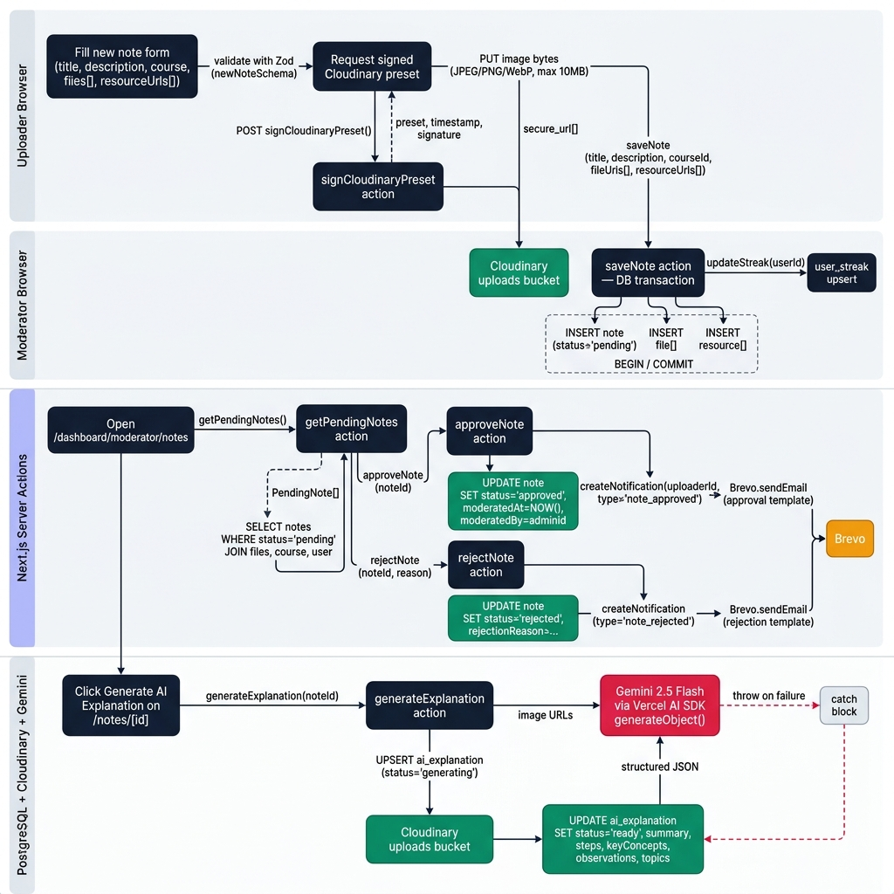
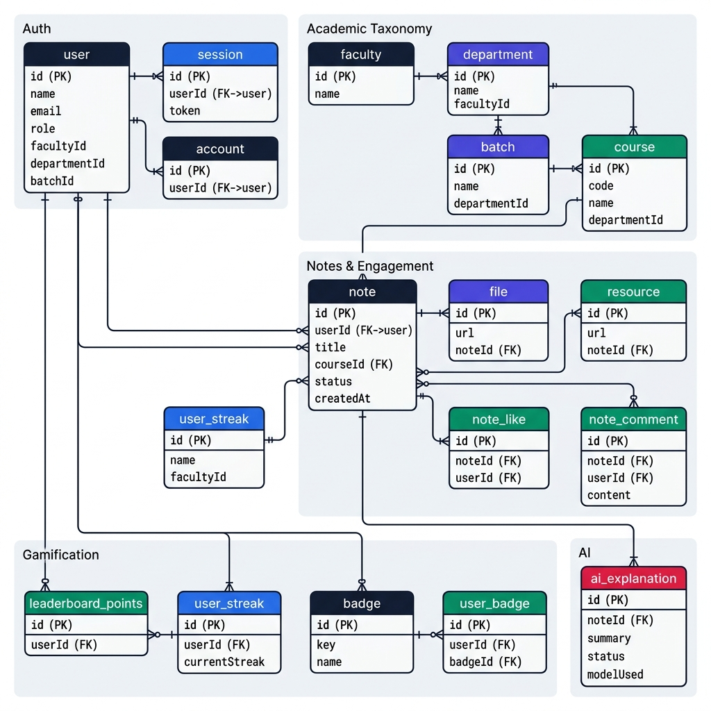
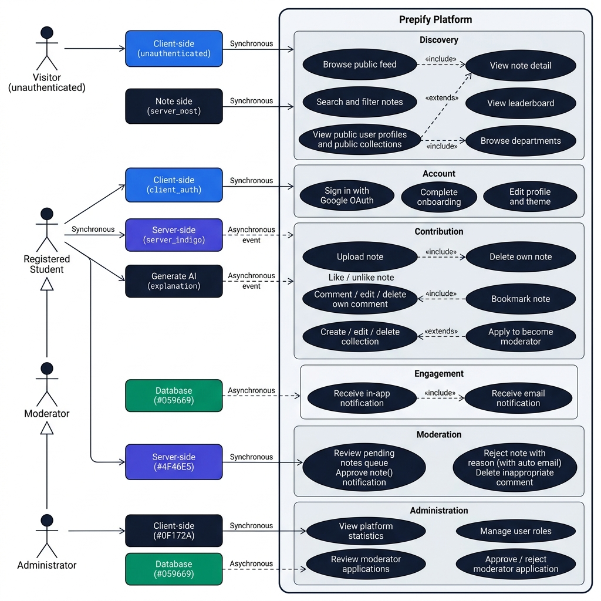
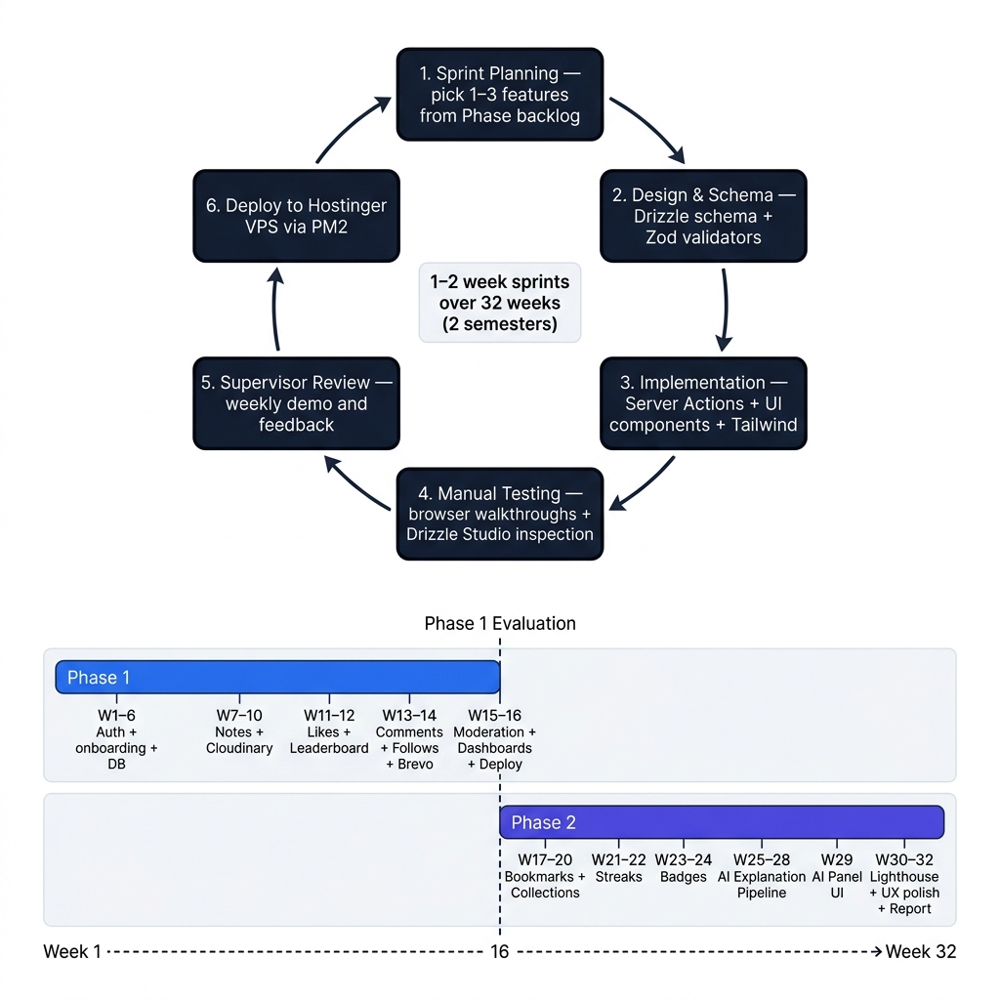
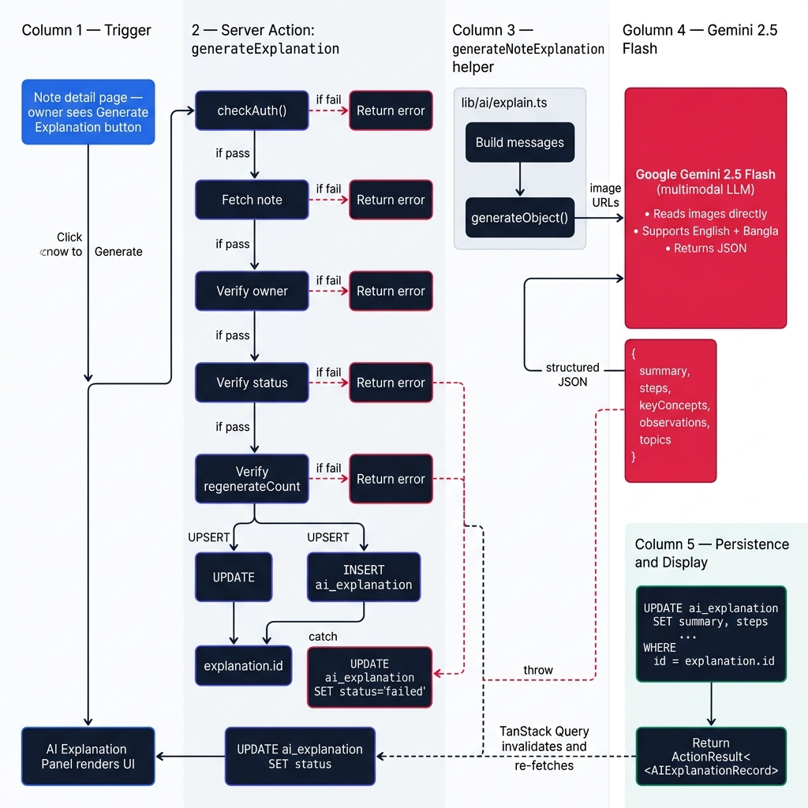
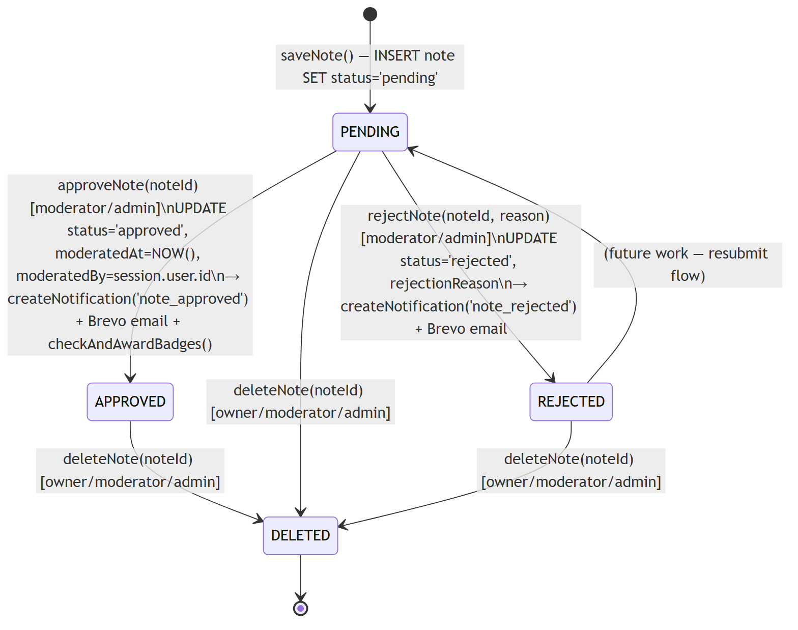
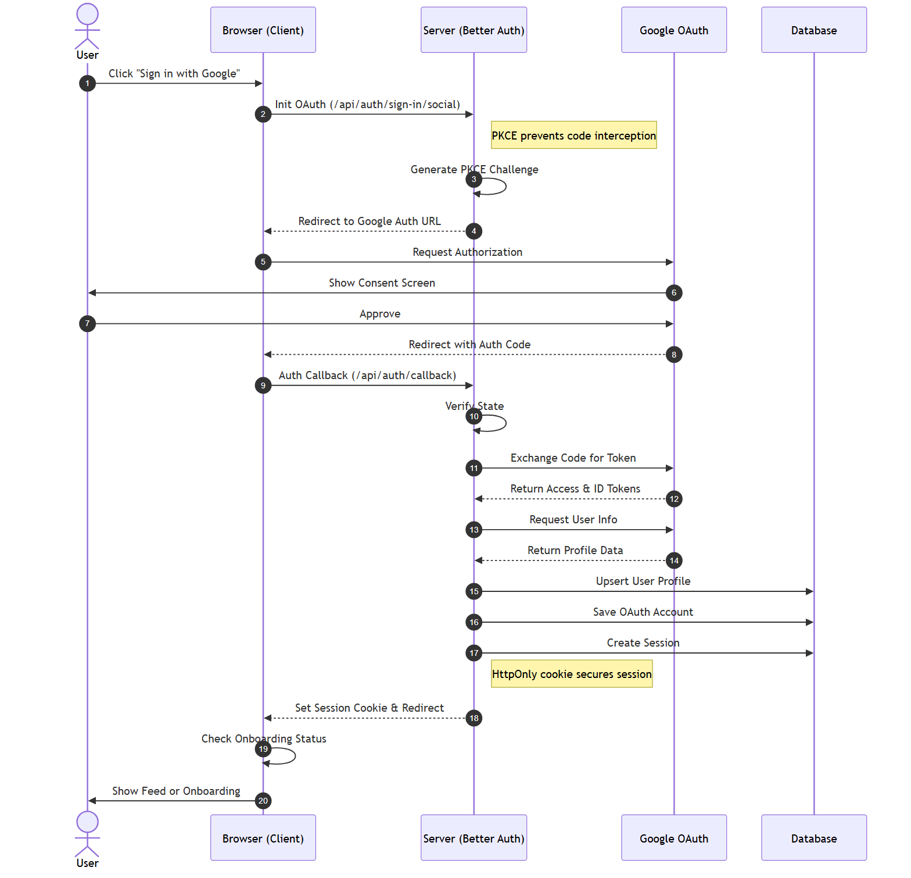
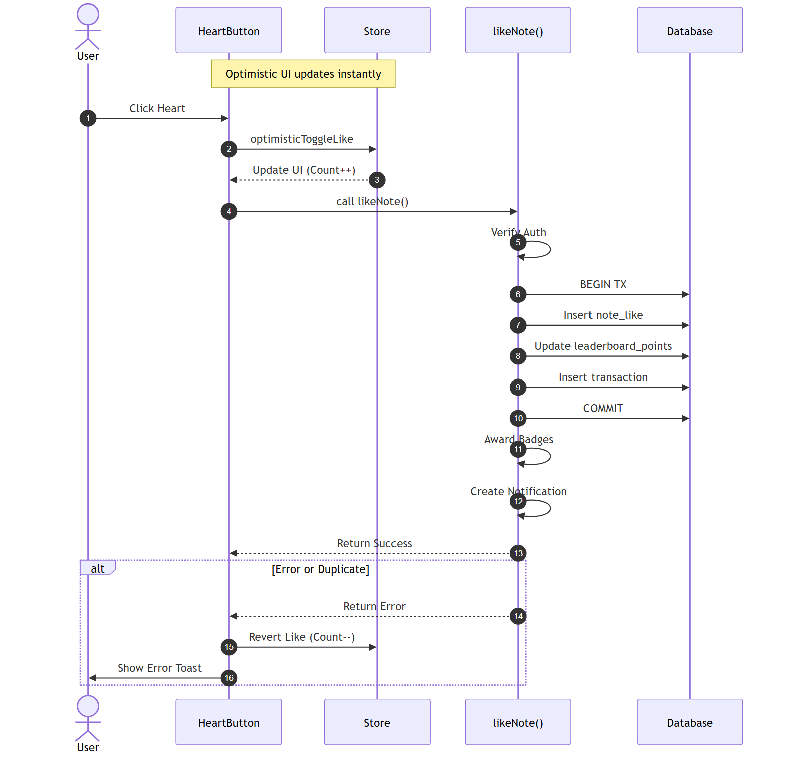

# Generated Project Report Diagrams

The following 9 technical diagrams have been generated according to the instructions in `report_files/Diagram_Generation_Prompts.md`, combining your specific structure details with the requested "clean modern flat vector" style preface. For the Mermaid charts, we used the `@mermaid-js/mermaid-cli` to perfectly render the exact sequence and state diagrams.

## Chapter 3 Diagrams

**Figure 3.1: System Architecture of Prepify**

**Figure 3.2: Data Flow Diagram — Note Upload, Moderation, AI Explanation**

*(Visual Style Option)*

**Figure 3.3: Entity Relationship Diagram (Database Schema)**

**Figure 3.4: Use Case Diagram**

**Figure 3.5: Agile Development Methodology Cycle**

## Chapter 4 Diagrams

**Figure 4.1: AI Explanation Pipeline (Multimodal LLM Flow)**

**Figure 4.2: Note Moderation State Machine**

**Figure 4.3: Authentication Flow — Google OAuth 2.0 with PKCE**

**Figure 4.4: Like and Leaderboard Transaction Flow**

---

> [!NOTE]
> As per your prompt file, the remaining 3 screenshot composites (Figures 3.6, 4.5, and 4.6) must be captured manually from the deployed site at `prepify.space`.
