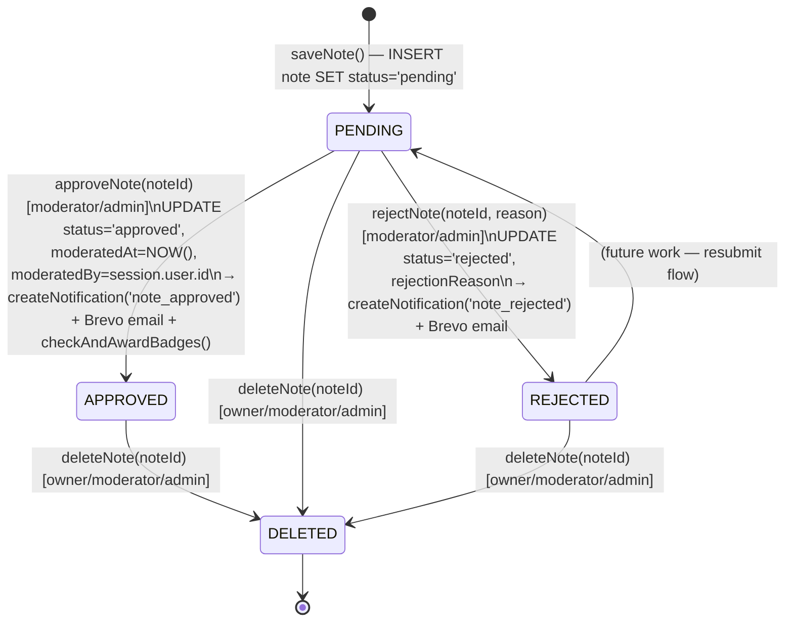
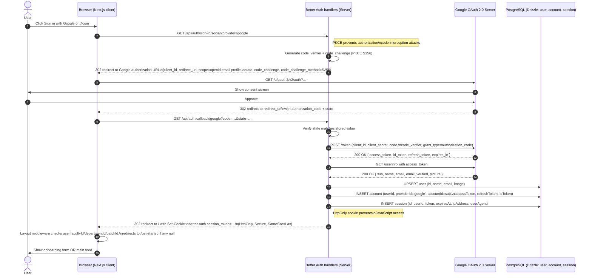
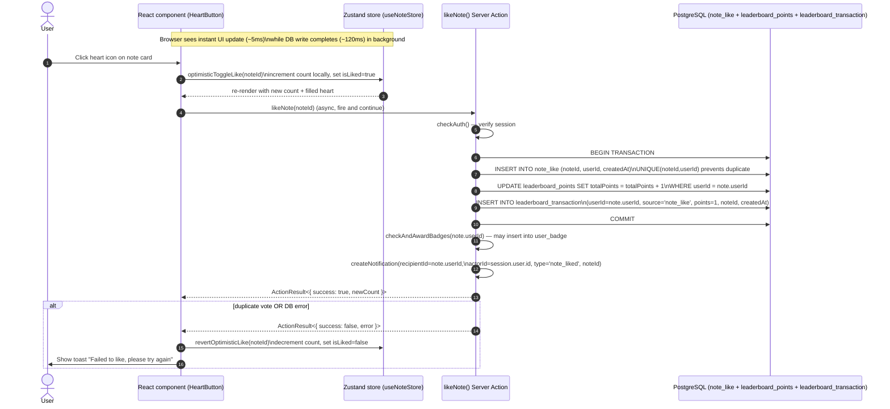

# Prepify FYDP Report — Diagram Generation Prompts

This document contains the complete figure inventory for the Prepify Final Year Design Project report and ready-to-paste prompts for generating each diagram. Every prompt is written with concrete data, exact node names, exact field names, and exact arrow labels drawn from the actual Prepify codebase, so the resulting diagrams reflect the real system rather than generic placeholders.

---

## Figure Inventory

The report includes **12 figures total** — 9 generated technical diagrams and 3 screenshot composites that should be captured directly from the deployed site at `prepify.space`.

| #    | Figure                                                       | Type                 | Chapter |
| ---- | ------------------------------------------------------------ | -------------------- | ------- |
| 3.1  | System Architecture of Prepify                               | Diagram              | Ch. 3   |
| 3.2  | Data Flow Diagram — Note Upload, Moderation, AI Explanation  | Diagram              | Ch. 3   |
| 3.3  | Entity Relationship Diagram (Database Schema)                | Diagram              | Ch. 3   |
| 3.4  | Use Case Diagram                                             | Diagram              | Ch. 3   |
| 3.5  | Agile Development Methodology Cycle                          | Diagram              | Ch. 3   |
| 3.6  | UI Design — Landing Page and Note Detail                     | Screenshot composite | Ch. 3   |
| 4.1  | AI Explanation Pipeline (Multimodal LLM Flow)                | Diagram              | Ch. 4   |
| 4.2  | Note Moderation State Machine                                | Diagram              | Ch. 4   |
| 4.3  | Authentication Flow — Google OAuth 2.0 with PKCE             | Sequence diagram     | Ch. 4   |
| 4.4  | Like and Leaderboard Transaction Flow                        | Sequence diagram     | Ch. 4   |
| 4.5  | Moderator and Admin Dashboard Screens                        | Screenshot composite | Ch. 4   |
| 4.6  | AI Explanation Panel and User Profile                        | Screenshot composite | Ch. 4   |

---

## Recommended Tools

For the 9 generated diagrams, the prompts in this document are designed to work well with the following tools:

- **Excalidraw** — best for the architecture diagram (3.1) and the data flow diagram (3.2)
- **draw.io / diagrams.net** — best for the ER diagram (3.3) and the use case diagram (3.4); it has built-in crow's-foot ER notation and UML use case shapes
- **Mermaid** — best for the state machine (4.2) and both sequence diagrams (4.3, 4.4); can be embedded directly in Markdown and exported as PNG/SVG
- **AI image generators** (ChatGPT image, Gemini image, Whimsical AI, Eraser.io) — work for any of the diagrams, but pass the **full prompt verbatim** including the style preface
- **Lucidchart** — works for everything if you prefer a single tool

For the 3 screenshot composites, capture screenshots from the live site and stitch them together with Figma, Photopea, or PowerPoint.

---

## Common Style Preface

Append this style preface to the front of every diagram prompt for visual consistency across the report:

> Clean modern technical diagram, white background, flat vector illustration style, no gradients, no 3D, no drop shadows, sharp clear edges, monospace labels for technical identifiers and sans-serif (Inter or Helvetica) for prose labels, all text horizontal and legible at 1200×800 resolution, rectangular nodes with 8px rounded corners, 2px border weight, color palette limited to: deep slate `#0F172A` for primary nodes, blue `#2563EB` for client side, indigo `#4F46E5` for server side, emerald `#059669` for database, amber `#F59E0B` for third party services, rose `#E11D48` for AI services, and light gray `#F1F5F9` for grouping containers. Solid arrows for synchronous calls, dashed arrows for asynchronous events. Every arrow must have a label.

---

## Figure 3.1 — System Architecture of Prepify

**Purpose:** Shows the three-tier architecture and how every external service connects to the Next.js application.

**Recommended tool:** Excalidraw or draw.io

**Prompt:**

> Three-tier architecture diagram for the web platform "Prepify", arranged top-to-bottom in three horizontal rows, each row inside a labeled light-gray container.
>
> **Top row (Client tier, blue `#2563EB`):** Three rounded rectangle nodes side by side: "Desktop Browser (Chrome/Firefox/Safari)", "Mobile Browser (Android/iOS)", "Tablet Browser". Below them a single subtitle "React 19.2 client components + Tailwind CSS 4 + shadcn/ui".
>
> **Middle row (Application tier, indigo `#4F46E5`):** A single large container labeled "Hostinger VPS — Ubuntu 22.04 LTS". Inside it stack three sub-blocks vertically: (a) "Nginx — TLS 1.3 + HTTP/2 reverse proxy", (b) "PM2 process manager", (c) "Next.js 16.1 application — App Router + Server Components + Server Actions". Inside the Next.js block list four module labels horizontally: "Auth module", "Notes module", "Moderation module", "AI module".
>
> **Bottom row (Data and external services tier):** Five separate nodes left to right:
>
> 1. Emerald `#059669` cylinder labeled "Neon Serverless PostgreSQL — 17 tables: user, session, faculty, department, batch, course, note, file, resource, note_like, note_comment, follow, notification, leaderboard_points, leaderboard_transaction, moderator_application, bookmark, collection, user_streak, badge, user_badge, ai_explanation"
> 2. Amber `#F59E0B` node labeled "Cloudinary — image upload, transformations, CDN delivery"
> 3. Amber `#F59E0B` node labeled "Google OAuth 2.0 — Identity Provider"
> 4. Amber `#F59E0B` node labeled "Brevo Transactional Email API"
> 5. Rose `#E11D48` node labeled "Gemini 2.5 Flash — multimodal LLM via Vercel AI SDK"
>
> **Arrows:**
>
> - Each browser node → Nginx, labeled "HTTPS / TLS 1.3"
> - Nginx → Next.js, labeled "HTTP/2 (internal)"
> - Next.js Auth module ↔ Google OAuth, labeled "OAuth 2.0 Authorization Code + PKCE"
> - Next.js Auth module → Neon, labeled "Drizzle ORM (session, user)"
> - Next.js Notes module → Neon, labeled "Drizzle ORM (note, file, resource, note_like, note_comment)"
> - Next.js Notes module → Cloudinary, labeled "signed upload preset (server signs, browser uploads direct)"
> - Browser → Cloudinary directly with a curved dashed arrow labeled "direct image upload, signed preset"
> - Cloudinary → Browser dashed arrow labeled "image delivery via CDN, auto WebP"
> - Next.js Moderation module → Brevo, labeled "transactional email (approve / reject / follow / comment)"
> - Next.js AI module → Gemini 2.5 Flash, labeled "generateObject() with Zod schema, image URLs"
> - Gemini → Next.js AI module dashed arrow labeled "structured JSON: summary, steps, keyConcepts, observations, topics"
> - Next.js AI module → Neon, labeled "Drizzle ORM (ai_explanation upsert)"
>
> Layout must be strictly horizontal at every tier. No decorative icons, no people figures.

---

## Figure 3.2 — Data Flow Diagram for Note Upload, Moderation, and AI Explanation

**Purpose:** Shows the complete data flow from a user filling the upload form through Cloudinary, the moderation queue, the email side effects, and finally the AI explanation generation.

**Recommended tool:** Excalidraw or draw.io with swim lanes

**Prompt:**

> Data flow diagram in left-to-right swim-lane format with four horizontal lanes labeled (top to bottom): "Uploader Browser", "Moderator Browser", "Next.js Server Actions", "PostgreSQL + Cloudinary + Gemini".
>
> Show the following sequence as nodes connected by labeled arrows:
>
> **Step 1 (Uploader lane):** Node "Fill new note form (title, description, course, files[], resourceUrls[])" → arrow "validate with Zod (newNoteSchema)" → Node "Request signed Cloudinary preset"
>
> **Step 2 (cross from Uploader → Server Actions lane):** Arrow labeled "POST signCloudinaryPreset()" → Node in Server Actions lane "signCloudinaryPreset action" → Arrow labeled "preset, timestamp, signature" back to Uploader lane.
>
> **Step 3 (cross from Uploader → PostgreSQL+Cloudinary lane):** Arrow labeled "PUT image bytes (JPEG/PNG/WebP, max 10MB)" → Node "Cloudinary uploads bucket" → Arrow labeled "secure_url[]" back to Uploader lane.
>
> **Step 4 (Uploader → Server Actions):** Arrow labeled "saveNote(title, description, courseId, fileUrls[], resourceUrls[])" → Node "saveNote action — DB transaction" in Server Actions lane.
>
> **Step 5 (Server Actions → DB):** From "saveNote action" three parallel arrows down into the DB lane: arrow 1 labeled "INSERT note (status='pending')", arrow 2 labeled "INSERT file[]", arrow 3 labeled "INSERT resource[]". Group them inside a dashed transaction box labeled "BEGIN / COMMIT".
>
> **Step 6 (Server Actions → Server Actions):** Arrow labeled "updateStreak(userId)" → small node "user_streak upsert".
>
> **Step 7 (Moderator lane):** Node "Open /dashboard/moderator/notes" → arrow "getPendingNotes()" → Server Actions lane node "getPendingNotes action" → arrow "SELECT notes WHERE status='pending' JOIN files, course, user" to DB → arrow back labeled "PendingNote[]" to Moderator lane.
>
> **Step 8 (Moderator decision branch):** From the Moderator lane split into two arrows:
>
> - Branch A: arrow "approveNote(noteId)" → Server Actions node "approveNote action" → DB arrow "UPDATE note SET status='approved', moderatedAt=NOW(), moderatedBy=adminId" → arrow "createNotification(uploaderId, type='note_approved')" → DB note in notification table → arrow "Brevo.sendEmail(approval template)" out to Brevo (drawn as a small amber node at the right edge).
> - Branch B: arrow "rejectNote(noteId, reason)" → Server Actions node "rejectNote action" → DB arrow "UPDATE note SET status='rejected', rejectionReason=…" → arrow "createNotification(type='note_rejected')" → arrow "Brevo.sendEmail(rejection template)".
>
> **Step 9 (AI Explanation flow, only on approved notes — draw beneath the moderation flow):** Uploader lane node "Click Generate AI Explanation on /notes/[id]" → arrow "generateExplanation(noteId)" → Server Actions node "generateExplanation action — auth check, ownership check, status='approved' check, regenerateCount < 3 check" → DB arrow "UPSERT ai_explanation (status='generating')" → arrow to a rose-colored node in the right column "Gemini 2.5 Flash via Vercel AI SDK generateObject() with explanationSchema (Zod)" labeled "image URLs from file table + course name + system prompt" → arrow back labeled "structured JSON: summary, steps[], keyConcepts[], observations, topics[]" → arrow to DB "UPDATE ai_explanation SET status='ready', summary, steps, keyConcepts, observations, topics, modelUsed='Gemini 2.5 Flash'".
>
> **Error path (dashed):** From the Gemini node a dashed red arrow labeled "throw on failure" back to a small node "catch block — UPDATE ai_explanation SET status='failed'".
>
> All step numbers (1 through 9) must be visible as small circled numbers next to the originating node. No decorative elements.

---

## Figure 3.3 — Entity Relationship Diagram (Database Schema)

**Purpose:** Shows every table in the Prepify database, every column with its type, every primary and foreign key, and every relationship with proper crow's-foot notation.

**Recommended tool:** draw.io with the Entity Relationship shape library, or dbdiagram.io (which produces clean ER diagrams from a DBML script)

**Prompt:**

> Crow's-foot Entity Relationship Diagram showing the full PostgreSQL schema for Prepify. Use rectangle entities with the entity name in a colored header bar and column rows below in monospace, formatted as `column_name : type [PK|FK|UNIQUE]`. Draw all relationship lines with proper crow's-foot notation (one or many on each end). Layout: spread the entities across a 4×5 grid, group related tables with light-gray background containers labeled "Auth", "Academic Taxonomy", "Notes & Engagement", "Social", "Gamification", "Moderation", "AI".
>
> **Auth group (header color slate `#0F172A`):**
>
> - `user`: id (PK), name, email (UNIQUE), emailVerified, image, username (UNIQUE), role (enum: user|moderator|admin), facultyId (FK), departmentId (FK), batchId (FK), themePreference, createdAt
> - `session`: id (PK), userId (FK→user), token (UNIQUE), expiresAt, ipAddress, userAgent
> - `account`: id (PK), userId (FK→user), providerId, accountId, accessToken, refreshToken, idToken, expiresAt
>
> **Academic Taxonomy group (color emerald `#059669`):**
>
> - `faculty`: id (PK), name, slug (UNIQUE)
> - `department`: id (PK), name, facultyId (FK→faculty), slug
> - `batch`: id (PK), name, departmentId (FK→department)
> - `course`: id (PK), code (UNIQUE), name, departmentId (FK→department)
>
> **Notes & Engagement group (color indigo `#4F46E5`):**
>
> - `note`: id (PK), userId (FK→user), title, description, courseId (FK→course), departmentId (FK→department), facultyId (FK→faculty), viewsCount, status (enum: pending|approved|rejected), moderatedAt, moderatedBy (FK→user), rejectionReason, createdAt, updatedAt
> - `file`: id (PK), url, noteId (FK→note CASCADE)
> - `resource`: id (PK), url, noteId (FK→note CASCADE)
> - `note_like`: id (PK), noteId (FK), userId (FK), createdAt, UNIQUE(noteId, userId)
> - `note_comment`: id (PK), noteId (FK), userId (FK), content, createdAt, updatedAt
>
> **Social group (color amber `#F59E0B`):**
>
> - `follow`: id (PK), followerId (FK→user), followingId (FK→user), createdAt, UNIQUE(followerId, followingId)
> - `notification`: id (PK), recipientId (FK→user), actorId (FK→user), type (enum), noteId (FK nullable), isRead, createdAt
>
> **Gamification group (color rose `#E11D48`):**
>
> - `leaderboard_points`: id (PK), userId (FK→user UNIQUE), totalPoints
> - `leaderboard_transaction`: id (PK), userId (FK), source (enum: note_like, note_unlike, …), points, noteId (FK nullable), createdAt
> - `bookmark`: id (PK), userId (FK), noteId (FK), collectionId (FK→collection nullable), createdAt, UNIQUE(userId, noteId)
> - `collection`: id (PK), userId (FK→user), name, description, isPublic, createdAt, updatedAt
> - `user_streak`: id (PK), userId (FK UNIQUE), currentStreak, longestStreak, lastActiveDate, updatedAt
> - `badge`: id (PK), key (UNIQUE), name, description, icon, category, threshold
> - `user_badge`: id (PK), userId (FK), badgeId (FK), earnedAt, UNIQUE(userId, badgeId)
>
> **Moderation group (color slate):**
>
> - `moderator_application`: id (PK), userId (FK), reason, status (enum: pending|approved|rejected), reviewedBy (FK nullable), reviewedAt, createdAt
>
> **AI group (color rose):**
>
> - `ai_explanation`: id (PK), noteId (FK→note CASCADE UNIQUE), summary, steps (jsonb), keyConcepts (jsonb), observations, topics (jsonb), modelUsed, status (enum: generating|ready|failed), regenerateCount, generatedAt, updatedAt
>
> **Relationships to draw with crow's-foot notation:**
>
> - `user 1—∞ note`, `user 1—∞ note_comment`, `user 1—∞ note_like`
> - `note 1—∞ file`, `note 1—∞ resource`, `note 1—∞ note_like`, `note 1—∞ note_comment`, `note 1—1 ai_explanation`
> - `course 1—∞ note`, `department 1—∞ note`, `department 1—∞ course`, `faculty 1—∞ department`
> - `user ∞—∞ user via follow`, `user 1—∞ notification (recipient)`, `user 1—∞ notification (actor)`
> - `user 1—1 leaderboard_points`, `user 1—∞ leaderboard_transaction`
> - `user 1—∞ bookmark`, `note 1—∞ bookmark`, `collection 1—∞ bookmark`, `user 1—∞ collection`
> - `user 1—1 user_streak`, `user 1—∞ user_badge`, `badge 1—∞ user_badge`
> - `user 1—∞ moderator_application`
>
> All foreign keys must have `ON DELETE CASCADE` indicated as a small "CASCADE" tag on the relationship line where applicable. No decorative elements; pure schema diagram.

---

## Figure 3.4 — Use Case Diagram

**Purpose:** Shows every actor in the system, every use case they can perform, the inheritance between roles, and the include / extend relationships between use cases.

**Recommended tool:** draw.io UML use case shapes, or PlantUML

**Prompt:**

> UML use case diagram with three actor stick figures on the left edge labeled (top to bottom) "Visitor (unauthenticated)", "Registered Student", "Moderator", and "Administrator" — note that "Moderator" inherits from "Registered Student" and "Administrator" inherits from "Moderator". Draw inheritance with a hollow triangle arrow.
>
> A large rounded-rectangle system boundary on the right labeled "Prepify Platform" contains the following use case ovals, grouped vertically:
>
> **Discovery (top, available to Visitor and above):**
>
> - "Browse public feed"
> - "View note detail"
> - "Search and filter notes by faculty, department, course"
> - "View leaderboard"
> - "View public user profiles and public collections"
> - "Browse departments"
>
> **Account (Registered Student and above):**
>
> - "Sign in with Google OAuth"
> - "Complete onboarding (username, faculty, department, batch, theme)"
> - "Edit profile and theme"
>
> **Contribution (Registered Student and above):**
>
> - "Upload note (multi-image + resources)"
> - "Edit own note"
> - "Delete own note"
> - "Like / unlike note" «extends» "View note detail"
> - "Comment / edit / delete own comment"
> - "Bookmark note into collection (private or public)"
> - "Create / edit / delete collection"
> - "Generate AI explanation (own approved note, ≤ 3 regenerations)"
> - "Follow / unfollow user"
> - "Apply to become moderator"
>
> **Engagement (auto-triggered, drawn as a small bordered region):**
>
> - "Receive in-app notification"
> - "Receive email notification"
> - "Earn achievement badge"
> - "Maintain daily streak"
>
> **Moderation (Moderator and above):**
>
> - "Review pending notes queue"
> - "Approve note (with auto email)"
> - "Reject note with reason (with auto email)"
> - "Delete inappropriate comment"
>
> **Administration (Administrator only):**
>
> - "View platform statistics"
> - "Manage user roles (promote / demote)"
> - "Review moderator applications"
> - "Approve / reject moderator application"
>
> Use «include» dashed arrows where appropriate (e.g. "Comment on note" includes "View note detail", "Like note" includes "View note detail"). Use «extends» dashed arrows for AI explanation extending note detail. No decorative elements.

---

## Figure 3.5 — Agile Development Methodology Cycle

**Purpose:** Shows the sprint cycle that the project followed and the phase-by-phase timeline across the two FYDP semesters.

**Recommended tool:** Excalidraw (top half), draw.io or PowerPoint Gantt (bottom half), then composite

**Prompt:**

> Two diagrams stacked in a single image:
>
> **Top half — circular sprint cycle:** Six rounded rectangles arranged as a clockwise circle with curved arrows between them (1→2→3→4→5→6→1):
>
> 1. "Sprint Planning — pick 1–3 features from Phase backlog"
> 2. "Design & Schema — Drizzle schema + Zod validators"
> 3. "Implementation — Server Actions + UI components + Tailwind"
> 4. "Manual Testing — browser walkthroughs + Drizzle Studio inspection"
> 5. "Supervisor Review — weekly demo and feedback"
> 6. "Deploy to Hostinger VPS via PM2"
>
> Center of the circle: a small box labeled "1–2 week sprints over 32 weeks (2 semesters)".
>
> **Bottom half — phase timeline (horizontal Gantt-style):** A horizontal axis labeled "Week 1 ……………………………………… Week 32". Two horizontal swim lanes:
>
> - **Phase 1 (Weeks 1–16, blue bar):** Inside the bar, evenly spaced milestones marked: "W1–6 Auth + onboarding + DB", "W7–10 Notes + Cloudinary", "W11–12 Likes + Leaderboard", "W13–14 Comments + Follows + Brevo", "W15–16 Moderation + Dashboards + Deploy"
> - **Phase 2 (Weeks 17–32, indigo bar):** Inside the bar, milestones: "W17–20 Bookmarks + Collections", "W21–22 Streaks", "W23–24 Badges", "W25–28 AI Explanation Pipeline", "W29 AI Panel UI", "W30–32 Lighthouse + UX polish + Report"
>
> Vertical dashed line at week 16 labeled "Phase 1 Evaluation". No decorative elements.

---

## Figure 4.1 — AI Explanation Pipeline (Multimodal LLM Flow)

**Purpose:** Shows the end-to-end flow of an AI explanation generation request, including every validation check, both upsert branches, the structured-output enforcement, and the error path.

**Recommended tool:** Excalidraw or draw.io

**Prompt:**

> Detailed pipeline diagram showing the AI explanation generation flow, drawn left-to-right in five vertical columns. Each column has a header label.
>
> **Column 1 — Trigger (blue `#2563EB`):**
>
> - Node "Note detail page (/notes/[id]) — owner sees Generate Explanation button"
> - Below, a small condition box: "visible only when note.userId === session.user.id AND note.status === 'approved' AND files.length > 0"
> - Arrow down to "Click Generate / Regenerate" → arrow rightward to Column 2
>
> **Column 2 — Server Action: generateExplanation(noteId) (indigo `#4F46E5`):**
> Stack of five sequential validation nodes connected by arrows labeled "if pass":
>
> 1. "checkAuth() — return 401 if no session"
> 2. "Fetch note WITH course, files (Drizzle relational query) — return 404 if not found"
> 3. "Verify note.userId === session.user.id — return 403 otherwise"
> 4. "Verify note.status === 'approved' — return 400 otherwise"
> 5. "Verify regenerateCount < 3 (MAX_REGENERATIONS) — return 429 otherwise"
>
> Each "if fail" branch shown as a red dashed arrow to a small node "Return ActionResult<{error, status}>" on the side.
>
> Below validations, two parallel UPSERT branches drawn with a small diamond decision node labeled "existingExplanation?":
>
> - Branch yes: "UPDATE ai_explanation SET status='generating', regenerateCount += 1"
> - Branch no: "INSERT ai_explanation (noteId, status='generating', regenerateCount=0)"
>
> Both branches converge into a single arrow leftward labeled "explanation.id".
>
> **Column 3 — generateNoteExplanation(imageUrls, courseName) helper (rose `#E11D48`):**
> One large container labeled "lib/ai/explain.ts" containing:
>
> - Sub-node "Build messages: { system: tutor prompt with course context, user: 'Analyze N pages and provide structured explanation' + N image parts (type: 'image', image: new URL(secureUrl))}"
> - Sub-node "generateObject({ model: aiModel, schema: explanationSchema, messages })" with a small caption "Vercel AI SDK enforces Zod schema on response"
>
> Arrow rightward labeled "image URLs (from Cloudinary CDN, public)" to Column 4.
>
> **Column 4 — Gemini 2.5 Flash (rose, larger node):**
> Node titled "Google Gemini 2.5 Flash (multimodal LLM)". Inside it list:
>
> - "Reads images directly (no separate OCR step)"
> - "Supports English + Bangla + mixed scripts"
> - "Returns single JSON object matching explanationSchema"
>
> Arrow leftward (return path) labeled "structured JSON" with the JSON shape shown in a small monospace block:
>
> ```
> {
>   summary: string,
>   steps: [{stepNumber, title, content}],
>   keyConcepts: [{name, description}],
>   observations: string|null,
>   topics: string[]
> }
> ```
>
> **Column 5 — Persistence and Display (emerald `#059669`):**
>
> - Node "UPDATE ai_explanation SET summary, steps, keyConcepts, observations, topics, modelUsed='Gemini 2.5 Flash', status='ready', generatedAt=NOW(), updatedAt=NOW() WHERE id = explanation.id"
> - Arrow down to "Return ActionResult<AIExplanationRecord>"
> - Arrow leftward back to Column 1 labeled "TanStack Query invalidates and re-fetches"
> - Final node at bottom of Column 1: "AI Explanation Panel renders summary + numbered steps + key concepts + observations + topic chips"
>
> **Error path:** A red dashed arrow from the Gemini node back into Column 2 labeled "throw" → catch block node "UPDATE ai_explanation SET status='failed', updatedAt=NOW()"
>
> No decorative elements.

---

## Figure 4.2 — Note Moderation State Machine

**Purpose:** Shows every possible state of a note's `status` column and every transition between them, including the side effects triggered on each transition.

**Recommended tool:** Mermaid `stateDiagram-v2`, or draw.io UML state shapes

**Mermaid version (paste into any Mermaid renderer):**



**Long-form prompt for image generators:**

> UML state diagram for the lifecycle of a `note` row's `status` column.
>
> **States (rounded rectangles):**
>
> - Initial state: small filled black circle (UML start)
> - State 1: "PENDING — awaiting moderator review" (color amber `#F59E0B` fill, dark text)
> - State 2: "APPROVED — publicly visible on feed" (color emerald `#059669`)
> - State 3: "REJECTED — hidden from public, visible to author with reason" (color rose `#E11D48`)
> - State 4 (composite): "DELETED — cascade removes file, resource, note_like, note_comment, bookmark, ai_explanation" (color slate dark)
> - Terminal state: small bullseye (UML end)
>
> **Transitions (arrows):**
>
> - Start → PENDING, label: "saveNote() — INSERT note SET status='pending'"
> - PENDING → APPROVED, label: "approveNote(noteId) [moderator/admin] — UPDATE status='approved', moderatedAt=NOW(), moderatedBy=session.user.id" + side effect note "createNotification('note_approved') + Brevo email + checkAndAwardBadges()"
> - PENDING → REJECTED, label: "rejectNote(noteId, reason) [moderator/admin] — UPDATE status='rejected', rejectionReason" + side effect note "createNotification('note_rejected') + Brevo email"
> - REJECTED → PENDING, label: "(future work — resubmit flow)" drawn as a dashed arrow with a "future" tag
> - APPROVED, PENDING, REJECTED → DELETED, label: "deleteNote(noteId) [owner | moderator | admin]"
> - DELETED → end terminal
>
> **Side panel (right edge):** A small bordered box titled "Authorization matrix" with rows: "approveNote: moderator + admin", "rejectNote: moderator + admin", "deleteNote: owner OR moderator OR admin", "createNote: any authenticated user".
>
> No decorative elements.

---

## Figure 4.3 — Authentication Flow (Google OAuth 2.0 with PKCE)

**Purpose:** Shows the full Google OAuth handshake including the PKCE code verifier exchange, the user-info call, and the database writes that produce the session.

**Recommended tool:** Mermaid `sequenceDiagram`, or PlantUML

**Mermaid version:**



**Long-form prompt for image generators:**

> UML sequence diagram with five vertical lifelines labeled left-to-right:
>
> 1. "User"
> 2. "Browser (Next.js client)"
> 3. "Better Auth handlers (Server)"
> 4. "Google OAuth 2.0 Server"
> 5. "PostgreSQL (Drizzle: user, account, session)"
>
> Time flows top to bottom. Draw activation bars on each lifeline when active. Draw the following messages in order:
>
> 1. User → Browser: "Click Sign in with Google on /login"
> 2. Browser → Better Auth: "GET /api/auth/sign-in/social?provider=google"
> 3. Better Auth → Better Auth: "Generate code_verifier + code_challenge (PKCE S256)"
> 4. Better Auth → Browser: "302 redirect to Google authorization URL with client_id, redirect_uri, scope=openid email profile, state, code_challenge, code_challenge_method=S256"
> 5. Browser → Google: "GET /o/oauth2/v2/auth?…"
> 6. Google → User: "Show consent screen"
> 7. User → Google: "Approve"
> 8. Google → Browser: "302 redirect to redirect_uri with authorization_code + state"
> 9. Browser → Better Auth: "GET /api/auth/callback/google?code=…&state=…"
> 10. Better Auth → Better Auth: "Verify state matches stored value"
> 11. Better Auth → Google: "POST /token with client_id, client_secret, code, code_verifier, grant_type=authorization_code"
> 12. Google → Better Auth: "200 OK — { access_token, id_token, refresh_token, expires_in }"
> 13. Better Auth → Google: "GET /userinfo with access_token"
> 14. Google → Better Auth: "200 OK — { sub, name, email, email_verified, picture }"
> 15. Better Auth → PostgreSQL: "UPSERT user (id, name, email, image)"
> 16. Better Auth → PostgreSQL: "INSERT account (userId, providerId='google', accountId=sub, accessToken, refreshToken, idToken)"
> 17. Better Auth → PostgreSQL: "INSERT session (id, userId, token, expiresAt, ipAddress, userAgent)"
> 18. Better Auth → Browser: "302 redirect to / with Set-Cookie: better-auth.session_token=… (HttpOnly, Secure, SameSite=Lax)"
> 19. Browser → Browser: "Layout middleware checks user.facultyId/departmentId/batchId, redirects to /get-started if any null"
> 20. Browser → User: "Show onboarding form OR main feed"
>
> Add a small note balloon next to message 3 explaining "PKCE prevents authorization code interception attacks". Add another balloon next to message 18 explaining "HttpOnly cookie prevents JavaScript access".
>
> No decorative elements.

---

## Figure 4.4 — Like and Leaderboard Transaction Flow

**Purpose:** Shows the optimistic UI pattern paired with the transactional database write that keeps the leaderboard consistent with the like data, including the failure-rollback path.

**Recommended tool:** Mermaid `sequenceDiagram`, or PlantUML

**Mermaid version:**



**Long-form prompt for image generators:**

> UML sequence diagram showing optimistic UI + transactional database write for the like action. Five lifelines left-to-right:
>
> 1. "User"
> 2. "React component (HeartButton)"
> 3. "Zustand store (useNoteStore)"
> 4. "likeNote() Server Action"
> 5. "PostgreSQL (note_like + leaderboard_points + leaderboard_transaction)"
>
> Messages in order:
>
> 1. User → React: "Click heart icon on note card"
> 2. React → Zustand: "optimisticToggleLike(noteId) — increment count locally, set isLiked=true"
> 3. Zustand → React: "re-render with new count + filled heart"
> 4. React → Server Action: "likeNote(noteId) (async, fire and continue)"
> 5. Server Action → Server Action: "checkAuth() — verify session"
> 6. Server Action → PostgreSQL: "BEGIN TRANSACTION"
> 7. Server Action → PostgreSQL: "INSERT INTO note_like (noteId, userId, createdAt) — UNIQUE(noteId,userId) prevents duplicate"
> 8. Server Action → PostgreSQL: "UPDATE leaderboard_points SET totalPoints = totalPoints + 1 WHERE userId = note.userId"
> 9. Server Action → PostgreSQL: "INSERT INTO leaderboard_transaction (userId=note.userId, source='note_like', points=1, noteId, createdAt)"
> 10. Server Action → PostgreSQL: "COMMIT"
> 11. Server Action → Server Action: "checkAndAwardBadges(note.userId) — may insert into user_badge"
> 12. Server Action → Server Action: "createNotification(recipientId=note.userId, actorId=session.user.id, type='note_liked', noteId)"
> 13. Server Action → React: "ActionResult<{ success: true, newCount }>"
>
> **Alt frame (failure path) at the bottom:**
> Inside an "alt — duplicate vote OR DB error" combined fragment:
>
> - Server Action → React: "ActionResult<{ success: false, error }>"
> - React → Zustand: "revertOptimisticLike(noteId) — decrement count, set isLiked=false"
> - React → User: "Show toast 'Failed to like, please try again'"
>
> Place a note balloon at the top right reading "Browser sees instant UI update (~5ms) while DB write completes (~120ms) in background". No decorative elements.

---

## Screenshot Composites (Capture from Live Site)

The following figures are not generated through prompts — they are screenshots captured from the deployed site at `prepify.space` and stitched into a single image using Figma, Photopea, or PowerPoint.

### Figure 3.6 — UI Design (Landing Page and Note Detail)

A side-by-side composite of two screenshots:

- **Left:** the full landing page captured in light mode. Should show the hero section, the platform stats strip, the featured notes carousel, and a portion of the department browser.
- **Right:** a note detail page captured in dark mode. Should show the title, uploader info with follow button, the image gallery, and the start of the comments section.

Recommended dimensions: 1600×900 px combined. Add a thin 1px border around each screenshot. Caption underneath.

### Figure 4.5 — Moderator and Admin Dashboard Screens

A 1×3 grid of screenshots:

- **Left:** moderator dashboard at `/dashboard/moderator/notes` showing the pending notes queue with the image preview, uploader, course, and approve / reject controls visible.
- **Center:** admin dashboard landing page at `/dashboard/admin` showing the platform statistics (total users, total notes, pending moderation count) and the recent activity list.
- **Right:** admin user management page at `/dashboard/admin/users` showing the user table with role assignment controls.

Recommended dimensions: 1800×600 px combined.

### Figure 4.6 — AI Explanation Panel and User Profile

Two screenshots side by side:

- **Left:** a note detail page with the AI explanation panel rendered. Should show the summary at the top, two or three numbered step cards, the key concepts list, the observations block, and the topic-tag chips at the bottom.
- **Right:** a public user profile page at `/user/[username]` showing the avatar, username, faculty/department/batch, total points, the badges row, and the start of the approved notes list.

Recommended dimensions: 1600×900 px combined.

---

## Workflow Recommendations

1. **Diagrams first, screenshots last.** Generate the 9 technical diagrams before capturing the screenshots, because the diagrams clarify what UI elements are most important to surface in the screenshots.
2. **Keep raw source files.** When using draw.io or Excalidraw, save the `.drawio` or `.excalidraw` source file alongside the exported PNG so that any reviewer feedback can be applied without redrawing from scratch.
3. **Export at 2× resolution.** Set every diagram export to 2× DPI so that the figures stay sharp when the Word document is converted to PDF and printed.
4. **Use figure cross-references in the report.** When pasting the images into the Word file, use Word's "Cross-reference" feature to link inline mentions of "Figure 3.1" to the actual figure caption, so that the numbering stays consistent if a figure is added or removed later.
5. **Caption format.** Use the FYDP template caption style: `Figure 3.1: System Architecture of Prepify` placed directly below the image, centered, in italic.

---

## Quick Color Reference

Reuse this palette across every diagram for visual consistency:

| Purpose            | Hex       | Use For                                  |
| ------------------ | --------- | ---------------------------------------- |
| Primary nodes      | `#0F172A` | Headings, primary entities, dark text    |
| Client tier        | `#2563EB` | Browsers, React components               |
| Server tier        | `#4F46E5` | Server Actions, application server       |
| Database tier      | `#059669` | PostgreSQL, Drizzle, persistence         |
| Third party        | `#F59E0B` | Cloudinary, Brevo, Google OAuth          |
| AI services        | `#E11D48` | Gemini 2.5 Flash, AI SDK                 |
| Grouping container | `#F1F5F9` | Light gray backgrounds for swim lanes    |
| Error / failure    | `#DC2626` | Red dashed arrows for error paths        |

---

## Appendix — Mermaid-Ready Snippets

The two sequence diagrams (4.3, 4.4) and the state machine (4.2) above include Mermaid blocks that can be pasted directly into:

- the Mermaid Live Editor at <https://mermaid.live>
- any Markdown viewer that supports Mermaid (GitHub, GitLab, Obsidian, Notion)
- the Mermaid CLI for batch PNG export: `mmdc -i diagram.mmd -o diagram.png -s 2`

Once exported, replace the placeholder figure references in `Final_Report.md` with the rendered images by inserting the image into the corresponding section of the Word document.
